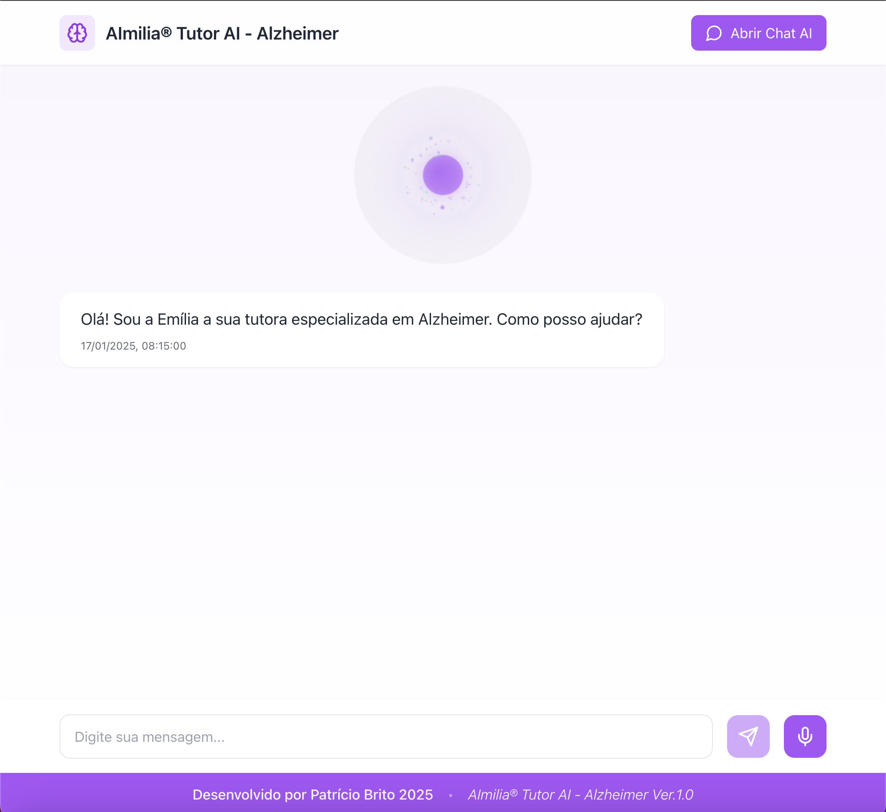

# AImilia® Tutor AI - Alzheimer

<div align="center">
  
  
  [](https://reactjs.org/)
  [](https://openai.com/)
  [](https://www.typescriptlang.org/)
  [](https://tailwindcss.com/)
</div>

## 🧠 Sobre o Projeto

AImilia® é uma tutora virtual especializada em Alzheimer, desenvolvida para fornecer informações precisas e suporte sobre a doença de Alzheimer. Com uma interface moderna e intuitiva, a AImilia® utiliza tecnologia avançada de IA para oferecer respostas contextualizadas e detalhadas sobre diversos aspectos da doença.

### ✨ Características Principais

- 🎯 **Especialização em Alzheimer**: Base de conhecimento focada e atualizada
- 🗣️ **Interface por Voz**: Interação natural através de comandos de voz
- 💫 **VoiceSphere**: Feedback visual interativo durante interações
- 📱 **Design Responsivo**: Adaptável a diferentes dispositivos
- 🤖 **IA Avançada**: Powered by GPT-4 para respostas precisas
- 🔄 **Contexto Inteligente**: Mantém o histórico da conversa para respostas mais relevantes

## 🛠️ Tecnologias Utilizadas

- **Frontend**: React + TypeScript
- **Estilização**: Tailwind CSS
- **IA**: OpenAI GPT-4
- **Animações**: Canvas API
- **Voz**: Web Speech API
- **Build**: Vite
- **Ícones**: Lucide Icons

## 🚀 Funcionalidades

- Respostas detalhadas sobre Alzheimer
- Interação por voz com feedback visual
- Histórico de conversas contextual
- Informações sobre tratamentos e medicamentos
- Dicas para cuidadores
- Exercícios cognitivos recomendados
- Interface adaptativa e acessível

## 💻 Instalação e Uso

1. Clone o repositório
```bash
git clone [seu-repositorio]
```

2. Instale as dependências
```bash
npm install
```

3. Configure as variáveis de ambiente
```bash
cp .env.example .env
# Adicione sua chave da API OpenAI
```

4. Inicie o projeto
```bash
npm run dev
```

## 🎨 Preview

<div align="center">
  
</div>

## 👨‍💻 Desenvolvedor

Desenvolvido por **Patrício Brito** - Engenheiro de Software especializado em aplicações de IA.

- 🌐 [LinkedIn](https://www.linkedin.com/in/patriciobcs/)
- 📧 [Email](mailto:patriciobcs@gmail.com)

## 📄 Licença

Este projeto está sob a licença MIT. Veja o arquivo [LICENSE](LICENSE) para mais detalhes.

---

<div align="center">
  <sub>Feito com 💜 por Patrício Brito</sub>
</div>
